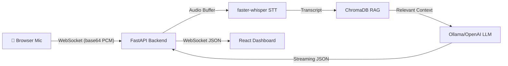

# Real-Time Sales Coaching POC

## What Was Built

A complete **Real-Time Sales Enablement Tool** POC that demonstrates the full pipeline: **live audio capture → real-time STT → RAG-powered AI coaching → premium dashboard**.

Built as a compelling Upwork proposal showcase with production-ready architecture.

## Architecture



---

## Files Created

### Backend (FastAPI + Python)

| File | Purpose |
|:-----|:--------|
| [config.py](../backend/config.py) | Centralized settings with env overrides. Swap STT/LLM providers via `.env` |
| [stt_engine.py](../backend/stt_engine.py) | STT abstraction layer — faster-whisper default, pluggable Deepgram/AssemblyAI/Google |
| [rag_engine.py](../backend/rag_engine.py) | ChromaDB RAG engine — document ingestion, chunking, semantic search |
| [ai_coach.py](../backend/ai_coach.py) | AI Coach using OpenAI SDK → works with Ollama, 1-line swap to OpenAI |
| [main.py](../backend/main.py) | FastAPI app — REST APIs + WebSocket endpoints for coaching & demo |
| [ingest.py](../backend/ingest.py) | Standalone document ingestion script |

### Sample Data

| File | Content |
|:-----|:--------|
| [sales_playbook.json](../backend/data/sales_playbook.json) | CloudSync Pro — pricing, opening scripts, value props, closing techniques, competitor comparisons |
| [objection_scripts.json](../backend/data/objection_scripts.json) | 6 objection categories with trigger phrases, primary/alternative scripts, tactics |
| [demo_transcript.json](../backend/data/demo_transcript.json) | 20-segment simulated sales call with realistic timing and multiple objections |
| [prompts.py](../backend/data/prompts.py) | Engineered system prompts with JSON output format and RAG context injection |

### Frontend (React + Vite + Tailwind)

| File | Purpose |
|:-----|:--------|
| [App.jsx](../frontend/src/App.jsx) | Main layout — 3-panel grid, state management, WebSocket orchestration |
| [AudioControls.jsx](../frontend/src/components/AudioControls.jsx) | Animated mic button, audio meter, language selector, demo toggle |
| [LiveTranscript.jsx](../frontend/src/components/LiveTranscript.jsx) | Auto-scrolling transcript with speaker labels and RTL support |
| [CoachingPanel.jsx](../frontend/src/components/CoachingPanel.jsx) | Color-coded AI coaching cards with streaming text and copy-to-clipboard |
| [CallStats.jsx](../frontend/src/components/CallStats.jsx) | Live metrics — duration, transcripts, suggestions, objections |
| [PlaybookSidebar.jsx](../frontend/src/components/PlaybookSidebar.jsx) | Searchable, collapsible playbook reference with click-to-copy |
| [websocket.js](../frontend/src/lib/websocket.js) | WebSocket manager with auto-reconnect + AudioCapture class |
| [index.css](../frontend/src/index.css) | Dark glassmorphism design system with animations and RTL styles |

---

## Key Design Decisions

1. **OpenAI SDK for LLM** — Works with Ollama out of the box (`base_url=http://localhost:11434/v1`). Swap to real OpenAI by changing 2 env vars.

2. **STT Provider Pattern** — Abstract `BaseSTTProvider` with `FasterWhisperProvider` as default. Deepgram/AssemblyAI/Google stubbed with clear TODO markers.

3. **RAG with ChromaDB** — Handles thousands of documents. Auto-chunks text, generates embeddings via sentence-transformers, and returns the top-K most relevant chunks to inject into the LLM prompt.

4. **Demo Mode** — Separate WebSocket endpoint (`/ws/demo`) plays back a pre-recorded sales call with realistic timing. No mic needed — perfect for Upwork showcasing.

5. **RTL Support** — `[dir="rtl"]` CSS selectors + HTML dir attribute toggle for Hebrew.

---

## Setup Instructions

Run these commands to get started:

```bash
# 1. Install system dependencies
sudo apt install python3.10-venv nodejs npm

# 2. Backend setup
cd backend
python3 -m venv venv
source venv/bin/activate
pip install -r requirements.txt
cp .env.example .env
python main.py

# 3. Frontend setup (in another terminal)
cd frontend
npm install
npm run dev

# 4. Install Ollama & pull model
curl -fsSL https://ollama.com/install.sh | sh
ollama pull llama3.2
```

Then visit **http://localhost:5173**.
