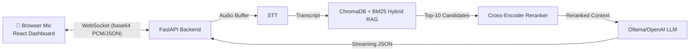

# Real-Time Sales Coaching POC

## What Was Built

A complete **Real-Time Sales Enablement Tool** POC that demonstrates the full pipeline: **live audio capture → real-time STT → RAG-powered AI coaching → premium dashboard**.

Built as a compelling Upwork proposal showcase with production-ready architecture.

## Architecture



---

## Files Created

### Backend (FastAPI + Python)

| File                                      | Purpose                                                                              |
| :---------------------------------------- | :----------------------------------------------------------------------------------- |
| [config.py](../backend/config.py)         | Centralized settings with env overrides. Swap STT/LLM providers via `.env`           |
| [stt_engine.py](../backend/stt_engine.py) | STT abstraction layer — faster-whisper default, pluggable Deepgram/AssemblyAI/Google |
| [rag_engine.py](../backend/rag_engine.py) | ChromaDB RAG engine with BM25 hybrid search and Cross-Encoder neural reranker        |
| [ai_coach.py](../backend/ai_coach.py)     | AI Coach using OpenAI SDK → works with Ollama, 1-line swap to OpenAI                 |
| [main.py](../backend/main.py)             | FastAPI app — REST APIs + WebSocket endpoints for coaching & demo                    |
| [ingest.py](../backend/ingest.py)         | Standalone document ingestion script with change data capture                        |

### Sample Data

| File                                                                   | Content                                                                                                     |
| :--------------------------------------------------------------------- | :---------------------------------------------------------------------------------------------------------- |
| [sales_playbook.json](../backend/data/sales_playbook.json)             | CloudSync Pro — pricing, opening scripts, value props, closing techniques, competitor comparisons (English) |
| [sales_playbook_he.json](../backend/data/sales_playbook_he.json)       | CloudSync Pro — playbook translated and formatted for Hebrew markets                                        |
| [objection_scripts.json](../backend/data/objection_scripts.json)       | 6 objection categories with trigger phrases, scripts, key tactics (English)                                 |
| [objection_scripts_he.json](../backend/data/objection_scripts_he.json) | Objection scripts in Hebrew with Right-to-Left formatting handling                                          |
| [demo_transcript.json](../backend/data/demo_transcript.json)           | 20-segment simulated sales call with realistic timing and multiple objections (English)                     |
| [demo_transcript_he.json](../backend/data/demo_transcript_he.json)     | Simulated sales call in Hebrew (RTL, 20 segments)                                                           |
| [prompts.py](../backend/data/prompts.py)                               | Engineered system prompts with JSON output format and RAG context injection                                 |

### Frontend (React + Vite + TypeScript)

| File                                                                  | Purpose                                                                 |
| :-------------------------------------------------------------------- | :---------------------------------------------------------------------- |
| [App.tsx](../frontend/src/App.tsx)                                    | Main layout — 3-panel grid, state management, WebSocket orchestration   |
| [AudioControls.tsx](../frontend/src/components/AudioControls.tsx)     | Animated mic button, audio meter, language selector, demo toggle        |
| [LiveTranscript.tsx](../frontend/src/components/LiveTranscript.tsx)   | Auto-scrolling transcript with speaker labels and RTL support           |
| [CoachingPanel.tsx](../frontend/src/components/CoachingPanel.tsx)     | Color-coded AI coaching cards with streaming text and copy-to-clipboard |
| [CallStats.tsx](../frontend/src/components/CallStats.tsx)             | Live metrics — duration, transcripts, suggestions, objections           |
| [PlaybookSidebar.tsx](../frontend/src/components/PlaybookSidebar.tsx) | Searchable, collapsible playbook reference with click-to-copy           |
| [websocket.ts](../frontend/src/lib/websocket.ts)                      | WebSocket manager with auto-reconnect + AudioCapture class              |
| [translations.ts](../frontend/src/lib/translations.ts)                | Localized string mappings for English and Hebrew UI elements            |
| [demoPlayer.ts](../frontend/src/lib/demoPlayer.ts)                    | Custom timing player that manages state updates for simulated calls     |
| [index.css](../frontend/src/index.css)                                | Dark glassmorphism design system with animations and RTL styles         |

---

## Key Design Decisions

1. **OpenAI SDK for LLM** — Works with Ollama out of the box (`base_url=http://localhost:11434/v1`). Swap to real OpenAI by changing 2 env vars.

2. **STT Provider Pattern** — Abstract `BaseSTTProvider` with `FasterWhisperProvider` as default. Deepgram/AssemblyAI/Google stubbed with clear TODO markers.

3. **Advanced RAG Pipeline** — Combines ChromaDB dense vector search with local BM25 sparse lexical scoring. Normalizes and fuses both scores ($\alpha=0.5$ default) before running a CPU-friendly neural reranker (`cross-encoder/ms-marco-TinyBERT-L-2-v2`) on the top-10 candidates to ensure ultra-precise context injection with low latency.

4. **Demo Mode** — Separate WebSocket endpoint (`/ws/demo`) plays back a pre-recorded sales call with realistic timing. No mic needed — perfect for Upwork showcasing.

5. **RTL Support** — `[dir="rtl"]` CSS selectors + HTML dir attribute toggle for Hebrew.

---

## Setup Instructions

Run these commands to get started:

```bash
# 1. Install system dependencies
sudo apt install python3.10-venv nodejs npm

# 2. Backend setup
cd backend
python3 -m venv venv
source venv/bin/activate
pip install -r requirements.txt
cp .env.example .env
python main.py

# 3. Frontend setup (in another terminal)
cd frontend
npm install
npm run dev

# 4. Install Ollama & pull model
curl -fsSL https://ollama.com/install.sh | sh
ollama pull llama3.2
```

Then visit **http://localhost:5173**.
