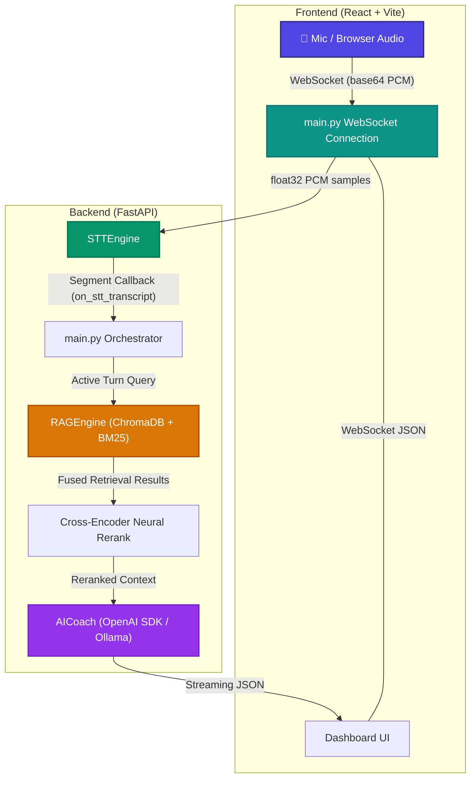
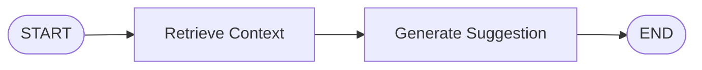
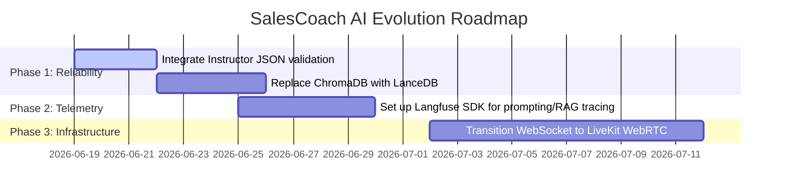

# 🏗️ Architectural Evaluation & Production Evolution Report

This report provides an in-depth analysis of the current **SalesCoach AI** POC architecture and evaluates how integrating frameworks like LangChain/LangGraph or other production-grade tools would impact performance, latency, and scalability.

---

## 🔍 Current Architecture Analysis

The application is structured as a low-latency, streaming pipeline built on FastAPI WebSockets and React.



### Key Components Under Evaluation

- **[main.py](../backend/main.py):** Orchestrates WebSocket events and coordinates transcription and coaching.
- **[stt_engine.py](../backend/stt_engine.py):** Handles local `faster-whisper` buffering, energy-based VAD, and third-party streaming API stubs.
- **[rag_engine.py](../backend/rag_engine.py):** Implements a hybrid search (ChromaDB dense vectors + BM25 sparse lexical search) fused via Reciprocal Rank Fusion (RRF) and reranked using a local Cross-Encoder transformer.
- **[ai_coach.py](../backend/ai_coach.py):** Directly leverages the `openai` SDK (`AsyncOpenAI`) to handle prompt injection and streaming generation.

---

## ⚖️ Framework Suitability: LangChain & LangGraph

We evaluated whether replacing parts of the custom pipeline with LangChain or LangGraph would improve the system.

### 1. LangChain

LangChain wraps LLM providers, prompt templates, vector stores, and output parsers in unified interfaces.

| Metric / Aspect              | Custom Implementation                                                                             | LangChain Implementation                                                                         |
| :--------------------------- | :------------------------------------------------------------------------------------------------ | :----------------------------------------------------------------------------------------------- |
| **Code Complexity**          | **Low**. Direct SDK calls via [AICoach](../backend/ai_coach.py#L30) are explicit and transparent. | **Medium**. Hides LLM mechanics behind abstractions.                                             |
| **Startup / Import Latency** | **Fast** (~0.1s import overhead).                                                                 | **Slow** (large dependency tree, can take 1.5s+ to import).                                      |
| **RAG Flexibility**          | **High**. Deep control over hybrid weights, RRF fusing, and reranking thresholds.                 | **Medium**. Requires custom subclasses to achieve the same custom BM25 + Cross-Encoder pipeline. |
| **Debugging Streaming**      | **Very Simple**. Standard asynchronous generators yielding text chunks.                           | **Complex**. Requires traversing nested stream objects (`astream`, `astream_events`).            |

> [!NOTE]
> **Verdict on LangChain:** **Avoid for core logic.** Your existing custom code is cleaner, more performant, and easier to debug than equivalent LangChain abstractions. It is only worth adopting if you need to load playbook data from many complex external connectors (Notion, Google Drive, Salesforce).

---

### 2. LangGraph

LangGraph is a stateful orchestration library that models agent workflows as graphs of nodes and edges, supporting cycles and memory.



_The current linear, non-agentic workflow has no branching, loops, or self-correction steps._

> [!WARNING]
> **Verdict on LangGraph:** **Highly Over-Engineered for the current scope.**
> LangGraph excels when an agent needs to execute multi-turn reasoning loops, run self-correction (e.g., test if code runs, rewrite if it fails), or collaborate as multiple specialized agents.
> Introducing it now adds state management complexity, latency overhead from state serialization, and boilerplate code without any functional benefits for a simple single-step stream.

---

## 🛠️ Recommended Production-Grade Tooling Stack

To mature this application from a prototype to a high-scale, production-ready system, we recommend adopting the following tools:

### 1. Networking & Audio Resilience: **LiveKit**

- **The Problem:** The app's custom WebSockets implementation is vulnerable to network latency, jitter, and packet drop, resulting in garbled or delayed audio.
- **The Solution:** Use **LiveKit** instead of raw WebSockets for real-time media.
- **Why it helps:** LiveKit operates over WebRTC, which is designed for ultra-low latency media transfer. It handles echo cancellation, packet loss concealment, and bandwidth adaptation. It also provides a React client hook (`useRoom`) and a Python SDK that can run transcription pipelines directly on the audio track.

### 2. Guarding Output Structures: **Instructor**

- **The Problem:** Local models (like Ollama's `llama3.2`) occasionally fail to output valid JSON, resulting in client parsing failures in [\_stream_coaching](../backend/main.py#L581).
- **The Solution:** Integrate **Instructor** (Python library).
- **Why it helps:** Instructor uses Pydantic to specify exact schemas and wraps LLM clients to guarantee structured data returned by models. If a model outputs invalid JSON, Instructor handles auto-retrying with an error feedback prompt behind the scenes:

  ```python
  import instructor
  from pydantic import BaseModel, Field

  class CoachingSuggestion(BaseModel):
      type: str = Field(description="objection, script, or tip")
      priority: str = Field(description="high or medium")
      title: str
      suggestion: str
      script: str

  # Patch the client to support response_model
  client = instructor.from_openai(AsyncOpenAI(...))
  suggestion = await client.chat.completions.create(
      model="llama3.2",
      response_model=CoachingSuggestion,
      messages=[...]
  )
  ```

### 3. Tracing & Telemetry: **Langfuse**

- **The Problem:** There is no centralized dashboard to monitor costs, latency, generation quality, or user-feedback ratings.
- **The Solution:** Implement **Langfuse**.
- **Why it helps:** Langfuse is an open-source LLM engineering platform. It traces every user session:
  1. Captures the raw transcript from [stt_engine.py](../backend/stt_engine.py).
  2. Records the exact documents retrieved from [RAGEngine](../backend/rag_engine.py).
  3. Visualizes latency bottlenecks (e.g., STT lag vs. RAG search time vs. LLM generation).
  4. Collects thumbs up/down user feedback from the React UI.

### 4. Vector Database Scaling: **LanceDB** or **Qdrant**

- **The Problem:** ChromaDB operates in-memory or via local directory storage. It is slow to initialize and difficult to scale or query in distributed deployments.
- **The Solution:** Move to **LanceDB** (in-process/serverless) or **Qdrant** (distributed microservice).
- **Why it helps:**
  - **LanceDB** is built in Rust and runs embedded inside your Python process (like SQLite). It is incredibly lightweight, stores vectors in raw column files, and executes searches in microseconds.
  - **Qdrant** is a dedicated vector database service with built-in sparse/dense hybrid search APIs. It allows running independent replicas and scaling vector storage horizontally.

### 5. Multi-Speaker Separation: **Deepgram Nova-3 Diarization**

- **The Problem:** The app assumes speaker roles (e.g. rep vs. prospect) based on browser controls.
- **The Solution:** Turn on **Diarization** inside the streaming STT configuration.
- **Why it helps:** Deepgram's streaming WebSocket offers real-time diarization. It automatically tags transcript words with speaker IDs (e.g., `speaker: 0` vs. `speaker: 1`) allowing the backend to dynamically attribute turns to the Sales Representative vs. the Customer.

## ⚡ Core Setup Improvisations (Immediate Code-Level Optimizations)

In addition to external tooling, several architectural optimizations can be implemented directly within your current codebase to drastically improve performance and latency:

### 1. Enable Ollama Context Caching (Prompt Restructuring)
- **The Opportunity:** Currently, [prompts.py](../backend/data/prompts.py#L9) inserts the dynamic `transcript` history directly into the system block. Because the system block changes on every single turn, Ollama cannot cache the prompt prefix, forcing it to re-parse the entire prompt (which includes the large RAG playbook context) from scratch every time.
- **The Improvisation:** Keep the system prompt static (only containing instructions and `{rag_context}`). Pass the dynamic transcript history as structured `user` and `assistant` role messages in the chat completions call.
- **The Value:** Ollama can cache the large prefix (playbook instructions + RAG data) in RAM, dropping prompt-processing latency from **~1.5s – 2.0s** down to **<0.1s**.

### 2. Binary WebSockets (Reduce Network Overhead)
- **The Opportunity:** [main.py](../backend/main.py#L417) receives audio as base64-encoded strings inside a JSON wrapper. Base64 encoding adds **33% data bloat** and increases encoding/decoding overhead in both JavaScript and Python.
- **The Improvisation:** Stream raw binary `Int16` (PCM) buffers directly over the WebSocket connection using FastAPI's binary message support (`WebSocket.receive_bytes()`).
- **The Value:** Cuts network bandwidth by 33%, removes JSON serialization overhead, and decreases overall packet transfer latency.

### 3. Machine-Learning Voice Activity Detection (VAD)
- **The Opportunity:** [stt_engine.py](../backend/stt_engine.py#L131) uses a naive energy-based threshold (`np.sqrt(np.mean(audio ** 2)) < 0.01`) to detect speech. In real-world environments, background noise, keystrokes, or hums will bypass this threshold, causing Whisper to transcribe silent or noisy frames.
- **The Improvisation:** Replace the manual energy calculations with **WebRTCVAD** or **Silero VAD** (local, fast python libraries).
- **The Value:** Ensures only actual speech triggers Whisper transcription, saving server CPU resources and avoiding "ghost" transcripts on the UI.

### 4. Semantic Caching for Objections
- **The Opportunity:** Customer objections (e.g., "We don't have the budget") often share high lexical and semantic similarity. Calling the LLM repeatedly to generate identical script rebuttals is slow and redundant.
- **The Improvisation:** Implement a lightweight local cache (using simple cosine-similarity against a list of previously answered objection vectors). If a customer's query matches a cached objection by >0.90 similarity, serve the response instantly from the cache.
- **The Value:** Delivers objection-handling coaching in **<10ms** instead of waiting 1.5s+ for local LLM token generation.

---

## 🗺️ Recommended Development Roadmap


