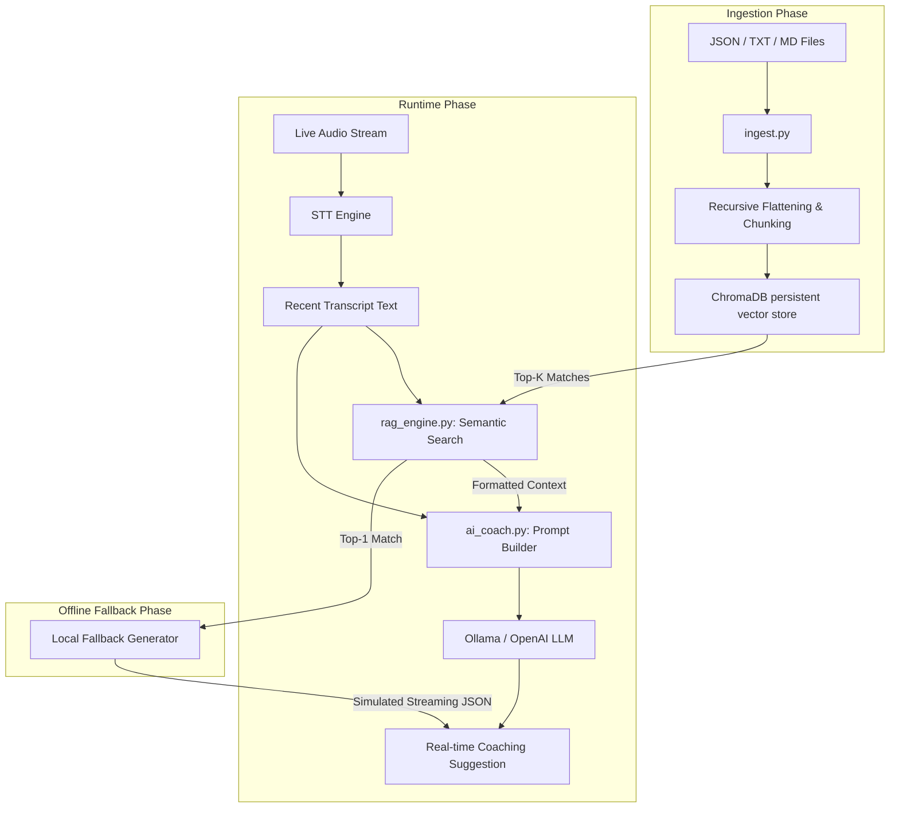

# Retrieval-Augmented Generation (RAG) Implementation

This document provides a detailed technical explanation of the **Retrieval-Augmented Generation (RAG)** architecture implemented in the Real-Time Sales Coaching project.

---

## 1. Architectural Overview

The RAG engine is designed to provide context-aware sales coaching during live calls. It retrieves relevant sections of sales playbooks, competitor comparison sheets, and objection-handling scripts based on the live transcription, injecting this context directly into the Large Language Model's (LLM) prompt context window.



---

## 2. Core Components

### 2.1 The Vector Database: ChromaDB
The project uses **ChromaDB** as its vector database, managed via `rag_engine.py`.
- **Client type:** `chromadb.PersistentClient` pointing to `backend/chroma_db/`. This ensures the vector index is persisted on disk between server restarts.
- **Collection name:** Controlled by `settings.RAG_COLLECTION_NAME` (default: `"sales_knowledge"`).
- **Distance Metric:** Cosine similarity (`"hnsw:space": "cosine"`).
- **Embedding Model:** ChromaDB's default embedding function, which leverages `all-MiniLM-L6-v2` (a 384-dimensional model from `sentence-transformers`). This runs completely locally and matches queries to documents efficiently.

### 2.2 The Ingestion Pipeline (`ingest.py` & `rag_engine.py`)
Documents are loaded, parsed, chunked, and upserted into the database using a standalone ingestion script:
```bash
python ingest.py          # Ingests all documents in backend/data/
python ingest.py --clear  # Clears the collection before re-ingesting
```

---

## 3. Data Processing & Ingestion Details

The ingestion engine supports two primary file categories: plain text (Markdown/TXT) and structured JSON files.

### 3.1 Plain Text & Markdown Ingestion
Plain text files are read completely, then split into overlapping chunks using a custom boundary-aware chunking method.

### 3.2 JSON Ingestion & Flattening
Sales playbooks and objection scripts are often highly structured JSON files. To ensure semantic compatibility with vector embeddings, the engine recursively flattens JSON data into readable text blocks:
- **Flat Objects:** Key-value pairs are formatted as plain-text lines.
- **Arrays of Objects:** Each object in the array becomes a distinct document chunk. Fields inside are formatted as:
  ```text
  [Section Prefix]
  Field1: Value1
  Field2: Value2
  ```
- **Nested Objects:** The nested keys are traversed recursively, building a structural hierarchy prefix (e.g., `Parent Key > Child Key`) so the semantic relationships are preserved in the text representation.

### 3.3 Custom Chunking Strategy
To prevent splitting sentences in half and losing semantic coherence, the chunking algorithm (`RAGEngine._chunk_text`) utilizes a boundary-aware sliding window:
1. **Window Size:** Chunks are sliced at `RAG_CHUNK_SIZE` characters (default: `500`).
2. **Boundary Detection:** If the chunk boundary falls mid-sentence, the algorithm looks backward up to 50% of the chunk size for sentence-ending punctuation (`. `, `! `, `? `, `\n`). If found, it splits the chunk at the end of the sentence.
3. **Overlap:** An overlap of `RAG_CHUNK_OVERLAP` characters (default: `50`) is appended to the start of the next chunk to maintain narrative continuity.

### 3.4 Idempotent Ingestions (Deterministic IDs)
To avoid duplicating the same content if the ingestion script is run multiple times, every chunk is assigned a deterministic ID:
```python
doc_id = hashlib.md5(f"{source}:{text}".encode()).hexdigest()
```
Using ChromaDB's `collection.upsert()` with these IDs ensures that modifying a file and re-ingesting updates the existing vectors instead of duplicating them.

---

## 4. Metadata Schema

Every document chunk inserted into ChromaDB is enriched with metadata to allow for filtering and UI rendering:

| Metadata Field | Type | Description | Example |
| :--- | :--- | :--- | :--- |
| `source` | `str` | Name of the source file (excluding extension) | `sales_playbook` |
| `source_type` | `str` | Type of data: `playbook`, `objection`, `knowledge`, or `document` | `objection` |
| `section` | `str` | JSON section pathway where the chunk was extracted (only for JSON files) | `objections > competitor_dropbox` |
| `chunk_index` | `int` | Sequential index of the chunk within the file | `2` |

---

## 5. Query & Retrieval Mechanics

At runtime, the active live transcript segment is sent to `RAGEngine.search()`:
- **Query Input:** The last several segments of the live conversation.
- **Top-K Search:** Returns the top $K$ results (controlled by `settings.RAG_TOP_K`, default: `5`).
- **Filtering:** Supports filtering by `source_type` if the system needs to narrow search to a specific category (e.g., searching only for objection-handling scripts when resistance is detected).

The query returns a list of dictionaries with the structure:
```python
{
    "text": "The chunked text content",
    "metadata": { ... },
    "distance": 0.285  # Cosine distance
}
```

---

## 6. Integration with the AI Sales Coach

The RAG results are consumed in two main ways within `ai_coach.py`.

### 6.1 Prompt Injection (Online Mode)
When the LLM is online, retrieved playbook snippets are formatted into an easily parsed context block and injected into the system prompt:

```text
[Source 1: sales_playbook (playbook)]
Product: CloudSync Pro
Pricing Tier: Standard plan is $15/user/month. Premium tier is $25/user/month...

[Source 2: objection_scripts (objection)]
Category: Pricing
Trigger: too expensive, over budget
Response: Explain the ROI. CloudSync Pro saves an average of 4 hours/week per employee...
```

The system prompt template merges this context into the `{rag_context}` placeholder, instructing the LLM to base its real-time coaching suggestions directly on these reference playbooks.

### 6.2 Local RAG Fallback (Offline Mode)
A key resilient feature of this project is the **Local RAG Fallback**. If the remote/local LLM endpoint is offline, unreachable, or errors out, the coach falls back to generating a coaching recommendation directly from ChromaDB:
1. **Query:** Searches the vector database for the top-1 match matching the live transcript.
2. **Category Extraction:** Parses the retrieved plain text to identify if the matched document represents an `objection` (looks for structural tags like `Category:` or `Response:`) or a generic playbook tip (looks for `Headline:` or `Detail:`).
3. **Structured JSON Construction:** Formats the extracted fields into the exact structured JSON response expected by the frontend:
   ```json
   {
     "type": "objection",
     "priority": "high",
     "title": "Handle Objection: Pricing",
     "suggestion": "The prospect raised concern about pricing. Reframe using the playbook track.",
     "script": "Explain the ROI. CloudSync Pro saves an average of 4 hours/week per employee..."
   }
   ```
4. **Simulated Streaming:** To ensure the frontend UI remains responsive and matches the user experience of a streaming LLM, the local fallback streams this JSON text string back in small character chunks (e.g., 6 characters at a time) separated by a short sleep delay (`15ms`).

---

## 7. RAG Settings Configuration

All parameters can be modified via environment variables in the backend's `.env` file:

```ini
# The name of the ChromaDB collection
RAG_COLLECTION_NAME=sales_knowledge

# Size of chunks in characters
RAG_CHUNK_SIZE=500

# Overlap size between adjacent chunks
RAG_CHUNK_OVERLAP=50

# Number of relevant search results to retrieve and inject into the prompt
RAG_TOP_K=5
```
