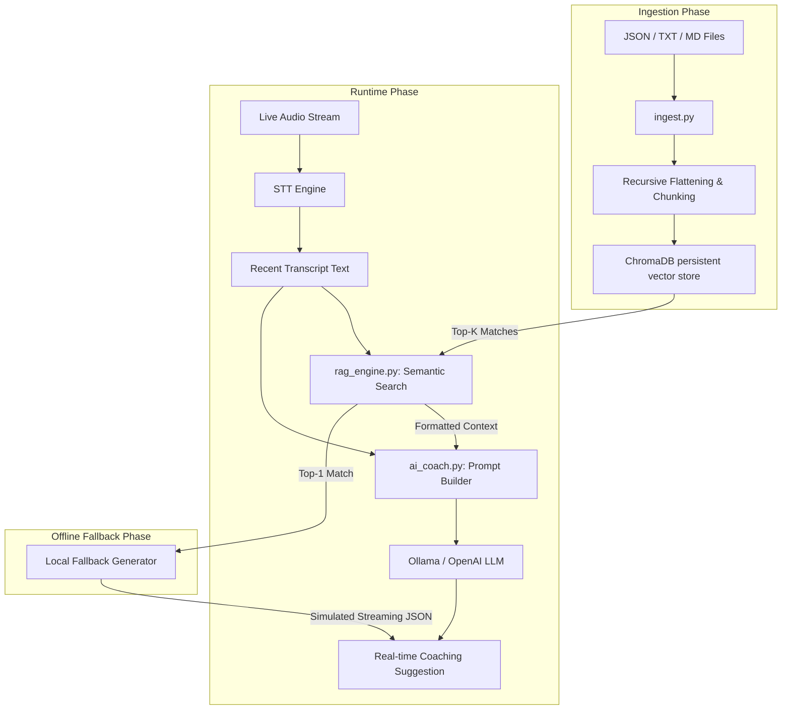
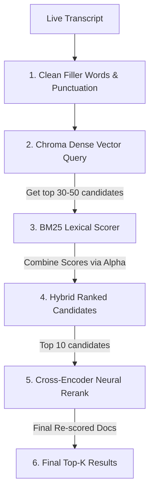

# Retrieval-Augmented Generation (RAG) Implementation

This document provides a detailed technical explanation of the **Retrieval-Augmented Generation (RAG)** architecture implemented in the Real-Time Sales Coaching project.

---

## 1. Architectural Overview

The RAG engine is designed to provide context-aware sales coaching during live calls. It retrieves relevant sections of sales playbooks, competitor comparison sheets, and objection-handling scripts based on the live transcription, injecting this context directly into the Large Language Model's (LLM) prompt context window.



---

## 2. Core Components

### 2.1 The Vector Database: ChromaDB
The project uses **ChromaDB** as its vector database, managed via `rag_engine.py`.
- **Client type:** `chromadb.PersistentClient` pointing to `backend/chroma_db/`. This ensures the vector index is persisted on disk between server restarts.
- **Collection name:** Controlled by `settings.RAG_COLLECTION_NAME` (default: `"sales_knowledge"`).
- **Distance Metric:** Cosine similarity (`"hnsw:space": "cosine"`).
- **Embedding Model:** ChromaDB's default embedding function, which leverages `all-MiniLM-L6-v2` (a 384-dimensional model from `sentence-transformers`). This runs completely locally and matches queries to documents efficiently.

### 2.2 The Ingestion Pipeline (`ingest.py` & `rag_engine.py`)
Documents are loaded, parsed, chunked, and upserted into the database using a standalone ingestion script:
```bash
python ingest.py          # Ingests all documents in backend/data/
python ingest.py --clear  # Clears the collection before re-ingesting
```

---

## 3. Data Processing & Ingestion Details

The ingestion engine supports two primary file categories: plain text (Markdown/TXT) and structured JSON files.

### 3.1 Plain Text & Markdown Ingestion
Plain text files are read completely, then split into overlapping chunks using a custom boundary-aware chunking method.

### 3.2 JSON Ingestion & Flattening
Sales playbooks and objection scripts are often highly structured JSON files. To ensure semantic compatibility with vector embeddings, the engine recursively flattens JSON data into readable text blocks:
- **Flat Objects:** Key-value pairs are formatted as plain-text lines.
- **Arrays of Objects:** Each object in the array becomes a distinct document chunk. Fields inside are formatted as:
  ```text
  [Section Prefix]
  Field1: Value1
  Field2: Value2
  ```
- **Nested Objects:** The nested keys are traversed recursively, building a structural hierarchy prefix (e.g., `Parent Key > Child Key`) so the semantic relationships are preserved in the text representation.

### 3.3 Structure-Aware and Paragraph-Aware Chunking Strategy
To keep semantic objects cohesive and prevent splitting information mid-sentence or mid-block, the engine employs a hybrid chunking strategy:
1. **JSON Q&A Block Intactness:** For sales playbooks or objection scripts, individual objects (like an objection category script or a value proposition) are kept completely intact as a single atomic document chunk (if under 1800 characters) rather than being split by characters.
2. **Paragraph-Aware Splitting:** Markdown and plain-text files are split by double newlines (`\n\n`) into logical paragraphs. These paragraphs are grouped together up to `RAG_CHUNK_SIZE` characters (default: `500`).
3. **Boundary Fallback:** If an individual paragraph exceeds the chunk size, the engine falls back to a sentence-ending boundary search (breaking at `. `, `! `, `? `, `\n`) within the sliding window, ensuring smooth character-based splits.
4. **Overlap:** Adjacent text-file chunks overlap by `RAG_CHUNK_OVERLAP` characters (default: `50`) to maintain context boundaries.

### 3.4 Change Data Capture & Delta Ingestion
To scale efficiently to large playbooks, the ingestion engine tracks files using a manifest (`ingestion_manifest.json`):
- Saves file paths, last modified timestamps, and MD5 file checksums.
- During ingestion, it checks the manifest. If a file is unmodified and exists in Chroma, the engine skips processing it.
- If a file is modified, the engine deletes all previous chunks associated with that file from the Chroma collection (preventing orphans) and re-ingests only the updated content.

---

## 4. Metadata Schema

Every document chunk inserted into ChromaDB is enriched with metadata to allow for filtering and UI rendering:

| Metadata Field | Type | Description | Example |
| :--- | :--- | :--- | :--- |
| `source` | `str` | Name of the source file (excluding extension) | `sales_playbook` |
| `source_type` | `str` | Type of data: `playbook`, `objection`, `knowledge`, or `document` | `objection` |
| `section` | `str` | JSON section pathway where the chunk was extracted | `objections > competitor_dropbox` |
| `chunk_index` | `int` | Sequential index of the chunk within the file | `2` |
| `language` | `str` | Language of the document (`en` or `he`) | `en` |

---

## 5. Query & Retrieval Mechanics (Hybrid Search & Reranking)

At runtime, the live transcript is queried using a multi-stage pipeline:



1. **Query Pre-processing:** The query string is cleaned by stripping common punctuation and filtering out speech disfluencies and filler words (*uh, um, like, so, basically, you know*, and Hebrew fillers like *אז, כאילו, כזה*).
2. **Dense Vector Search:** The cleaned query is vectorized and queried against ChromaDB to retrieve a larger candidate pool (e.g. 30–50 candidate chunks).
3. **Lexical Scoring (BM25):** The engine scores the candidates using a local BM25 scorer fitted on the entire document corpus.
4. **Hybrid Score Fusion:** Vector cosine similarity and BM25 scores are normalized and combined:
   $$\text{Hybrid Score} = \alpha \times \text{Normalized Vector Similarity} + (1 - \alpha) \times \text{Normalized BM25 Score}$$
5. **Neural Reranking:** The top 10 candidates from the hybrid stage are passed to a local Cross-Encoder model (`cross-encoder/ms-marco-TinyBERT-L-2-v2`). The model computes a sequence-pair attention score for each candidate relative to the query.
6. **Top-K Selection:** Candidates are sorted by the reranker's probability score, and the final top $K$ (default: `5`) are injected into the AI Coach prompt.

---

## 6. Integration with the AI Sales Coach

The RAG results are consumed in two main ways within `ai_coach.py`.

### 6.1 Prompt Injection (Online Mode)
When the LLM is online, retrieved playbook snippets are formatted into an easily parsed context block and injected into the system prompt:

```text
[Source 1: sales_playbook (playbook)]
Product: CloudSync Pro
Pricing Tier: Standard plan is $15/user/month. Premium tier is $25/user/month...

[Source 2: objection_scripts (objection)]
Category: Pricing
Trigger: too expensive, over budget
Response: Explain the ROI. CloudSync Pro saves an average of 4 hours/week per employee...
```

The system prompt template merges this context into the `{rag_context}` placeholder, instructing the LLM to base its real-time coaching suggestions directly on these reference playbooks.

### 6.2 Local RAG Fallback (Offline Mode)
If the remote/local LLM endpoint is offline, unreachable, or errors out, the coach falls back to generating a coaching recommendation directly from the search results:
1. **Query:** Searches the vector database for the top-1 match matching the live transcript.
2. **Category Extraction:** Parses the retrieved plain text to identify if the matched document represents an `objection` or a generic playbook tip.
3. **Structured JSON Construction:** Formats the extracted fields into the exact structured JSON response expected by the frontend.
4. **Simulated Streaming:** Streams this JSON text string back in small character chunks (e.g., 6 characters at a time) separated by a short sleep delay (`15ms`) to maintain a fluid streaming UI experience.

---

## 7. RAG Settings Configuration

All parameters can be modified via environment variables in the backend's `.env` file:

```ini
# The name of the ChromaDB collection
RAG_COLLECTION_NAME=sales_knowledge

# Size of chunks in characters
RAG_CHUNK_SIZE=500

# Overlap size between adjacent chunks
RAG_CHUNK_OVERLAP=50

# Number of relevant search results to retrieve and inject into the prompt
RAG_TOP_K=5

# Enable/disable hybrid dense-sparse search
RAG_ENABLE_HYBRID=True

# Weight of vector similarity vs. BM25 (0.0 = pure BM25, 1.0 = pure vector)
RAG_HYBRID_ALPHA=0.5

# Enable/disable filler word removal from STT queries
RAG_CLEAN_QUERY=True

# Enable/disable Cross-Encoder neural reranking
RAG_ENABLE_RERANKER=True

# Model identifier for the Cross-Encoder (TinyBERT is fast and runs on CPU)
RAG_RERANKER_MODEL=cross-encoder/ms-marco-TinyBERT-L-2-v2
```
